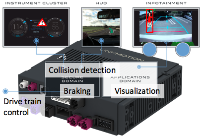
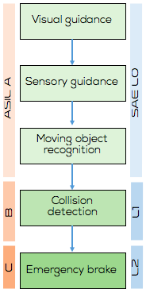
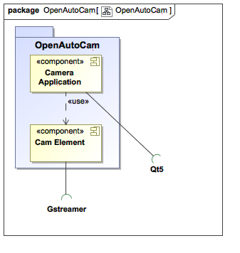

# cam-element

The purpose of the project is to develop camera component that can help driver to sense events around. Example of such camera is a reverse camera that helps driver to park car more safely and conveniently. Camera component could be used in Gstreamer based instrument clusters and infotainment systems.

The project roadmap is divided into phases in which assistance the camera provides to the driver increasing gradually. Increased assistance level requires additional safety measures. Target is that the camera compoennt meets requirements of the ISO/TS 29292 standard.

Project is structured into a Gstreamer element that can be combined with selected camera source and rendering output device.

Project is open for constributions. See github tasks.

Camera element code is licesed under LGPLv2, application under GPLv2 and documentation under creative commons license.

